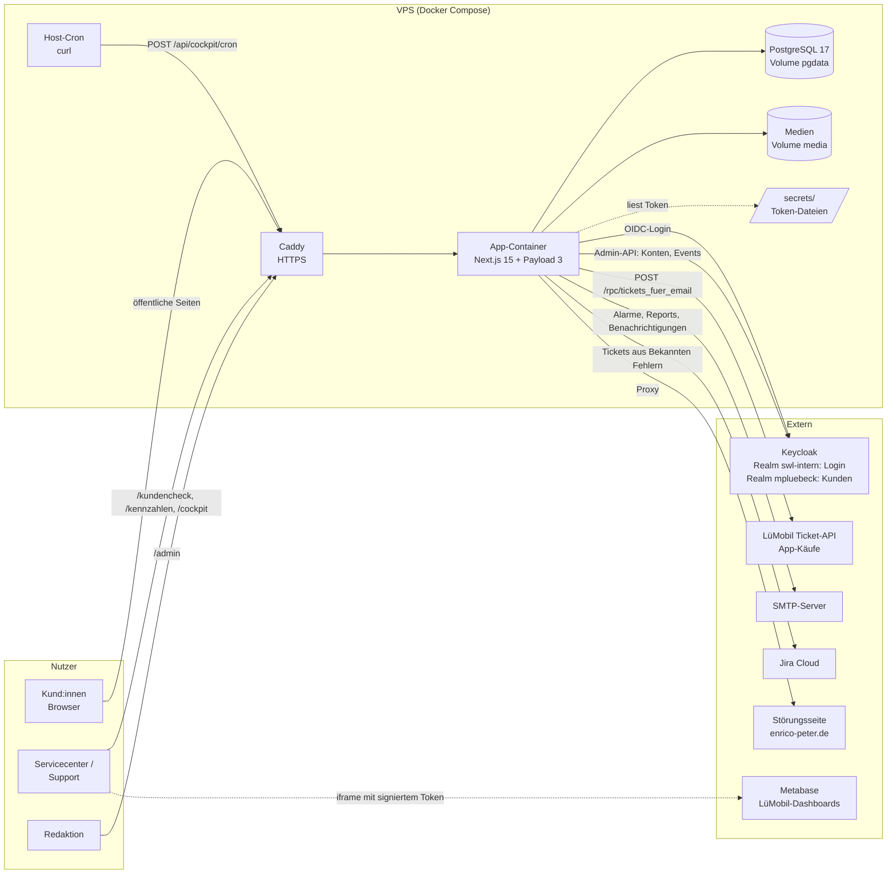
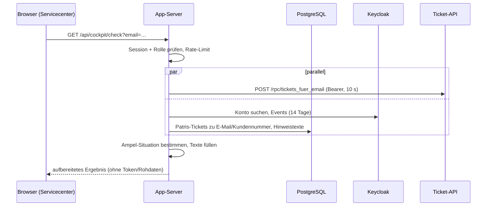

# Architektur

Überblick, wie das LüMobil Hilfecenter aufgebaut ist und mit welchen Systemen es
spricht. Details zu einzelnen Bereichen stehen in den verlinkten Dokumenten.

## Systemübersicht

## Bausteine

| Baustein | Technik | Aufgabe |
|---|---|---|
| Öffentliche Website | Next.js App Router, `src/app/(frontend)` | Hilfeartikel, FAQ, Handbuch, Offene Fragen, Bekannte Fehler, Störungen, Ausblick, Suche, Formulare |
| CMS | Payload 3, `/admin` | Pflege aller Inhalte; Benutzer = Redakteur:innen (eigene Payload-Konten) |
| Kundencheck | `/kundencheck`, `src/lib/cockpit/diagnose.ts` | Ampel aus Patris + Keycloak + Ticket-API |
| Migrations-Cockpit | `/cockpit`, `src/app/(cockpit)` | Kennzahlen, Verfügbarkeit, Reports, Patris-Upload |
| Kennzahlen | `/kennzahlen`, `src/lib/metabase.ts` | LüMobil-Dashboards aus Metabase; Server signiert nur das Token, der Browser lädt direkt von Metabase |
| Interne APIs | `src/app/api/cockpit/*`, `src/app/api/auth/*` | nur serverseitig geprüft (Rollen bzw. Cron-Secret) |
| Datenbank | SQLite (lokal), PostgreSQL (Produktion) | Inhalte, Meldungen, Cockpit-Daten, Patris-Tickets |
| Jobs | Host-Cron → `/api/cockpit/cron` (Prod), `pnpm job:*` (lokal) | Health-Check/Alerting, Tagesaggregat, Reports |

## Datenflüsse

**Kundencheck (eine Abfrage):**

**Anmeldung intern:** Browser → `/api/auth/login` → Keycloak (Realm
`KEYCLOAK_AUTH_REALM`, Authorization Code + PKCE) → `/api/auth/callback` →
signiertes Session-Cookie (8 Stunden) mit den Realm-Rollen.

**Patris-Daten:** CSV-Upload im Cockpit → Tabelle `patris_entitlements` wird in
einer Transaktion ersetzt.

## Zugriffsschutz in Schichten

1. **Middleware** (`src/middleware.ts`): optional Basic Auth für die ganze Seite
   (`SITE_BASIC_AUTH`), interne Pfade ausgenommen; noindex-Header.
2. **Frontend-Layout**: optional Keycloak-Pflicht für die ganze Seite
   (`SITE_KEYCLOAK_AUTH`).
3. **Seiten und APIs**: Rollenprüfung serverseitig (`src/lib/auth/guard.ts`).
4. **Payload Access Control**: Collections regeln Lesen/Schreiben im CMS.

## Umgebungen

| | Lokal (Mac) | Produktion (VPS) |
|---|---|---|
| Datenbank | SQLite `luemobil.db`, Schema per „push" | PostgreSQL, Schema per Migrationen beim Start |
| Keycloak | Mock-Modus (`COCKPIT_MOCK=true`) oder echtes Keycloak | echtes Keycloak |
| Ticket-API | Dev-System `https://localhost:8443` mit eigener CA | Prod-URL (steht noch aus) |
| Jobs | `pnpm job:*` | Host-Cron → HTTP |
| Secrets | `.env`, Token in `~/.config/luemobil-hilfecenter/` | `.env` auf dem Server, Token in `secrets/` |

## Weiterführend

- `KUNDENCHECK-COCKPIT.md` — Kundencheck, Cockpit, Rollen, Datenquellen
- `LIVE-GEHEN.md` — Deployment
- `docs/KEYCLOAK-EINRICHTUNG.md` — Keycloak-Konfiguration
- `PAYLOAD-CMS-ANLEITUNG.md` — CMS und Datenmodell
- `docs/KENNZAHLEN.md` — LüMobil-Dashboards (Metabase)
